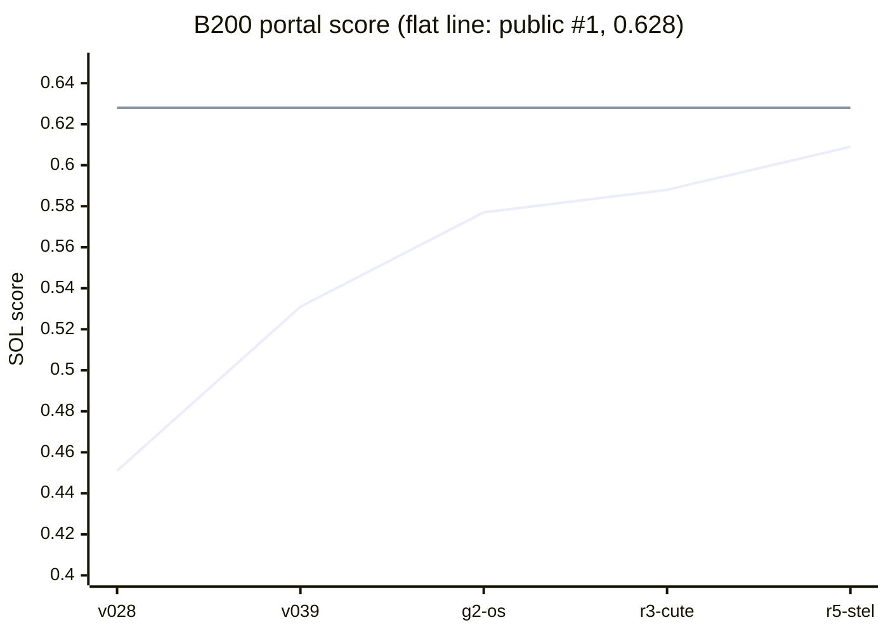
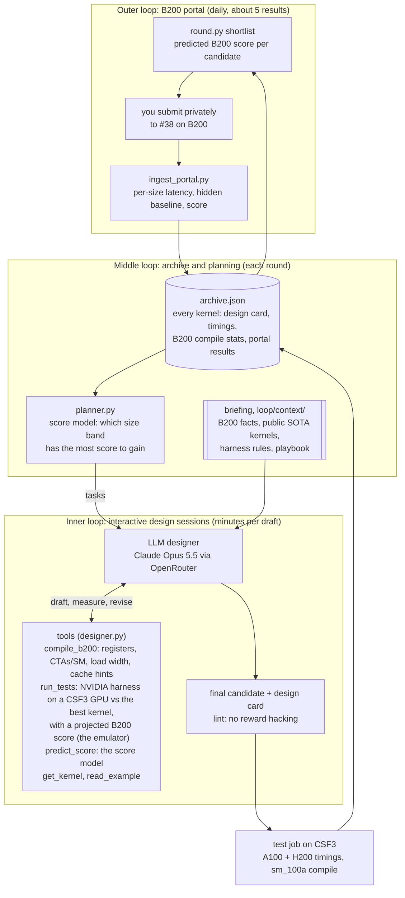

# solx: evolving B200 kernels without a B200

An automated loop in which an LLM designs, tests and refines GPU kernels for NVIDIA's
[SOL-ExecBench](https://research.nvidia.com/benchmarks/sol-execbench) leaderboard. The target is problem
**#38 `038_flux_multi_head_rmsnorm_qk`**: per-head RMSNorm of the query and key tensors of FLUX attention, in fp32,
at 16 input sizes from 13 MB to 805 MB of traffic. Kernels are scored on a B200, which we cannot access. We test on
the University of Manchester's CSF3 cluster (A100, L40S, H200) and get about five free B200 results a day from the
portal.

## Where we are

**0.609, 5th on the public board**, faster than NVIDIA's hidden baseline at all 16 sizes.



| Kernel | How it was made | B200 latency (geomean) | Portal score |
|---|---|---|---|
| Scoring baseline (hidden, NVIDIA) | - | 31.8 µs | 0.500 |
| `v028` | first submission: best of 72 Triton knob variants on A100 | 35.9 µs | 0.451 |
| `v039` | best knob variant on B200 (persistent grid) | 28.6 µs | 0.531 |
| `g2-os-r8w4` | generation 2: one-shot Triton kernel | 25.3 µs | 0.577 |
| `r3-cute-ldg256-os-r16` | loop round r3: CuTe DSL, 256-bit loads, no cache hints | 24.6 µs | 0.588 |
| `r5-ldg256-os-r16-stel` | round r5, first interactive session: outputs kept in L2 | **23.4 µs** | **0.609** |
| Leaderboard #1 (public) | - | 22.2 µs | 0.628 |

What is left: a fixed cost of about 3.2 µs on every call, which dominates small inputs (the best public B200 kernels
reach about 2.2–2.5 µs in total), and how much output stays in L2 at the end of medium and large inputs. Details:
[`loop/context/problem_038.md`](loop/context/problem_038.md).

## How the loop works



- **Inner loop: design sessions.** Each task from the planner becomes a conversation in which the LLM writes a
  kernel, then checks it with tools: it compiles the draft for the B200 (registers, CTAs per SM, 128- or 256-bit
  loads, cache hints), runs it through NVIDIA's harness on a CSF3 GPU against the current best kernel, sees the B200
  score that timing projects to, asks the score model which size band is worth effort, and reads excerpts of the best
  public B200 kernels. It revises until it is satisfied or its budget runs out, then hands in one kernel with a design
  card (hypothesis and expected effect per size band). The GPU tools are served by `toolserver.py`, one Slurm job per
  round on the first free A100 or L40S; no LLM time is spent until that GPU is up.
- **Middle loop: archive and planning.** The archive keeps every kernel's card, timings on each GPU, B200 compile
  statistics and portal results. The planner recovers the hidden baseline and SOL time per size from the portal pages,
  fits each B200 result as fixed cost + bytes / bandwidth, and turns the size band with the most score to gain into the
  next round's tasks. The briefing (`loop/context/`) holds B200 architecture facts, the harness rules, the problem
  card with every B200 result, a kernel playbook, and what the best public B200 kernels do.
- **Outer loop: the B200 portal.** The shortlist projects each tested candidate's speed on its most representative
  cheap GPU onto the best kernel's B200 per-size times. Designs that only a B200 can judge get exploration slots. You
  submit, save the result pages, and ingest them; the per-size results flow back into the archive, the planner and
  the briefing.

## Running a round

```bash
python3 loop/round.py plan      --round r7                   # what the planner would do (free)
python3 loop/round.py auto      --round r7 --interactive     # plan + design sessions + CSF3 test jobs
python3 loop/round.py auto      --round r7                   # the older one-shot mode: one LLM call per task
python3 loop/round.py status    --round r7                   # Slurm job states
python3 loop/round.py collect   --round r7                   # pull timings and B200 compile stats into the archive
python3 loop/round.py shortlist --round r7                   # -> loop/rounds/r7/portal/ (files to upload)
# after uploading: save each result page into html_results/, then
python3 poc/ingest_portal.py html_results/<page>.html
python3 loop/round.py table                                  # archive summary
```

An interactive session costs about $1–3 with Claude Opus 5.5 (the first one: 7 turns, 4 GPU tests, $1.41) and stops
at `--session-budget` (default $5). The briefing (about 45k tokens) and each conversation are prompt-cached for an
hour, so most input tokens are cache reads. Every call's tokens and cost are logged in `loop/runs/usage.jsonl`, and
every session's transcript is saved to `loop/rounds/<round>/sessions/`. The OpenRouter key is read from `.env`
(git-ignored) and never printed.

## Repository layout

| Path | What it is |
|---|---|
| `loop/round.py` | the loop driver (plan, propose, test, status, collect, shortlist, table) |
| `loop/designer.py`, `loop/toolserver.py` | interactive design sessions, and the GPU tool server they share on CSF3 |
| `loop/planner.py` | score model, task planning and portal shortlisting from B200 per-size data |
| `loop/context/` | the LLM's briefing: core brief, B200 architecture, public SOTA kernels (`b200_sota.md`, `examples/`), harness and scoring rules, problem card, playbook, generation protocol, sources. Facts carry confidence labels |
| `loop/llm.py`, `prompts.py`, `reply.py` | OpenRouter client, prompt assembly, reply parsing and lint |
| `loop/static_any.py` | compile any Triton, CuTe DSL or CUDA C++ candidate for sm_100a on a non-B200 node; registers, load widths, cache hints |
| `loop/archive.py`, `loop/archive/` | the archive and its summary table |
| `loop/rounds/<r>/` | each round: plan, prompts, session transcripts, candidates, results, portal shortlist |
| `loop/jobs/` | Slurm jobs: tool server, round tests, CUDA 13.1 container pull |
| `loop/gen2/` | generation 2: four hand-written Triton families |
| `poc/` | proof of concept: 72 variants, multi-GPU timing, the multi-fidelity emulator rehearsal, simulator runs, portal ingestion |
| `poc/results/b200_portal*.csv` | every B200 portal result, per submission and per size |

## Lessons so far

- **Letting the LLM experiment paid off at once.** The first interactive session tested three cache policies on an
  A100, including a control, and found the change behind the jump from 0.588 to 0.609.
- **Keeping outputs in L2 is the biggest lever so far.** Marking the output stores `evict_last` gained +0.021. Output
  still in the 126 MB L2 when the kernel ends is written back after the timer stops, so medium sizes gained 7–9%.
- **Width and hints, separated.** Against the hinted 128-bit Triton kernel (0.577): removing evict_first hints gave
  0.582, adding 256-bit loads 0.588, keeping stores in L2 0.609. Public B200 kernels also avoid evict_first stores.
- **The simplest design won on B200.** Dropping the persistent loop gained +0.046. Weight-stationary and TMA designs
  were slower at every size, and TMA rings add about 1–1.5 µs of fixed cost.
- **B200 compiles differently.** `v028` used 149 registers on sm_100a against 128 on sm_90a, so its persistent grid
  oversubscribed the SMs. Every candidate is now compiled for sm_100a before submission.
- **Cheap GPUs are a partial guide.** H200 ranks HBM-friendly variants like B200 does, but B200-only behaviour (256-bit
  loads, the 126 MB L2) shows up weakly or not at all, so those designs are judged by reasoning and exploration slots.
- **Portal arithmetic** (verified): latency is the geometric mean over sizes, the score is the arithmetic mean of
  per-size scores, and your own submission pages show the hidden baseline per size.

## Setup notes

- CSF3: everything lives in `/scratch/t95317ha/solx` (`source env.sh`). Use account `gpu-cdt-dmcs` for H200 and
  `gpu-sk01` for A100/L40S; `~/h200-scratch` is not mounted on A100/L40S nodes. GPU queues are often full
  (`QOSGrpGRES`), so the tool server queues on A100 and L40S at once.
- CUDA C++ candidates are built and tested inside NVIDIA's CUDA 13.1 container (Apptainer; `loop/jobs/pull_cuda13.sbatch`
  pulls it once). CSF3's newest module, CUDA 12.8, cannot assemble Blackwell's 256-bit loads.
- The `fbtriton==3.7.1` wheel used by NVIDIA's image misplaces `launch.h`; locally it is fixed with a symlink
  (`poc/README.md`). Triton and CuTe DSL solutions both run on the portal.
- The portal has no official upload API, so submission stays manual.
