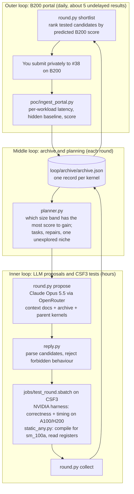

# Optimising a B200 kernel without a B200

An automated loop that designs GPU kernels for NVIDIA's [SOL-ExecBench](https://research.nvidia.com/benchmarks/sol-execbench)
leaderboard. The target is problem **#38 `038_flux_multi_head_rmsnorm_qk`**: per-head RMSNorm of the query and key
tensors of FLUX attention, in fp32, at 16 input sizes. Kernels are scored on a B200, which we cannot access. We test
on the University of Manchester's CSF3 cluster (A100, L40S, H200) and get about five free B200 results a day from the
portal.

## Where we are

| Kernel | How it was made | B200 latency (geomean) | Portal score |
|---|---|---|---|
| Scoring baseline (hidden, NVIDIA) | - | 31.8 µs | 0.500 |
| `v039` | best of 72 knob variants (proof of concept) | 28.6 µs | 0.531 |
| `g2-os-r8w4` / `g2-os-r16w8` | generation 2, one-shot Triton kernels | 25.3 µs | 0.577 |
| `r3-cute-ldg256-os-r16` | loop round r3, CuTe DSL with 256-bit loads (13th place) | **24.6 µs** | **0.588** |
| Leaderboard #1 (public) | - | 22.2 µs | 0.628 |

The best kernel beats the hidden baseline on all 16 input sizes. The score ceiling is about 0.74 (8 TB/s everywhere)
and about 0.68 with realistic fixed costs. The remaining gap is large-input bandwidth (6.8 TB/s, target about 7.2) and
small-input fixed cost (about 3.1 µs, target 1–2 µs). Details: [`loop/context/problem_038.md`](loop/context/problem_038.md).

## How the loop works



- **Inner loop (hours).** The inner LLM writes a kernel and a design card stating its hypothesis and expected effect
  per size band. Each prompt holds a cached briefing (`loop/context/`) plus the archive table and the parent kernels
  with their per-size B200 results. Candidates that look like reward hacking are rejected before they reach a GPU.
  Survivors go through NVIDIA's own harness on CSF3, and are compiled for the B200 so their register and
  shared-memory use is checked against the real target.
- **Middle loop (each round).** The archive keeps every kernel's card, timings on each GPU, B200 compile statistics
  and portal results. The planner turns these into the next round's tasks, using the hidden baseline and SOL times
  recovered from the portal pages to estimate how much score each improvement is worth.
- **Outer loop (daily).** The shortlist projects each candidate's speed on its most representative cheap GPU onto the
  best kernel's B200 per-size times, giving a predicted portal score. Designs that only a B200 can judge, such as
  256-bit loads, get exploration slots. Portal results flow back into the archive and recalibrate everything.

## Running a round

```bash
python3 loop/round.py plan      --round r3 --last-round r2   # what the planner would do (free)
python3 loop/round.py auto      --round r3 --last-round r2   # plan + LLM proposals + submit CSF3 tests
python3 loop/round.py status    --round r3                   # Slurm job states
python3 loop/round.py collect   --round r3                   # pull timings and B200 compile stats into the archive
python3 loop/round.py shortlist --round r3                   # -> loop/rounds/r3/portal/ (files to upload)
# after uploading: save each result page into html_results/, then
python3 poc/ingest_portal.py html_results/<page>.html
python3 loop/round.py table                                  # archive summary
```

One LLM call costs about $0.50–0.70 with Claude Opus 5.5. The briefing (about 41k tokens) is cached for an hour, so
the later calls in a round pay a fraction of it. Tokens and cost of every call are logged in `loop/runs/usage.jsonl`.
The OpenRouter key is read from `.env` (git-ignored) and never printed.

## Repository layout

| Path | What it is |
|---|---|
| `loop/context/` | the inner LLM's briefing: core brief, B200 architecture, harness and scoring rules, problem card, kernel playbook, generation protocol, sources. Facts carry confidence labels |
| `loop/round.py` | the loop driver (plan, propose, test, collect, shortlist, table) |
| `loop/planner.py` | task planning and portal shortlisting from B200 per-workload data |
| `loop/llm.py`, `prompts.py`, `reply.py` | OpenRouter client, prompt assembly, reply parsing and lint |
| `loop/static_any.py` | compile any Triton, CuTe DSL or CUDA C++ candidate for sm_100a on a non-B200 node and read its resources and load widths |
| `loop/archive.py`, `loop/archive/` | the archive and its summary table |
| `loop/rounds/<r>/` | each round: prompts, replies, candidates, results, portal shortlist |
| `loop/gen2/` | generation 2: four hand-written Triton families with runtime-sized persistent grids |
| `poc/` | proof of concept: 72 variants, multi-GPU timing, the emulator rehearsal, simulator runs, portal ingestion |
| `poc/results/b200_portal*.csv` | every B200 portal result, per submission and per workload |

## Lessons so far

- **The simplest design won on B200.** Dropping the persistent loop gained +0.046. Weight-stationary and TMA designs
  were slower at every size: weights reloaded from cache each tile are cheap, and TMA rings add about 1–1.5 µs of
  fixed cost.
- **B200 compiles differently.** `v028` used 149 registers on sm_100a against 128 on sm_90a, so its persistent grid
  oversubscribed the SMs and it gained nothing from B200's bandwidth. Every candidate is now compiled for sm_100a
  before submission, and persistent grids size themselves from the compiled kernel.
- **H200 is the best cheap guide, within limits.** It ranks HBM-friendly variants like B200 does, but small inputs run
  no faster on B200 than on H200, and B200-only features (256-bit loads) cannot be timed on any cheap GPU. The first
  256-bit kernel was sent as an exploration slot on its design card's reasoning alone and became the best (+0.011).
- **Portal arithmetic** (verified): latency is the geometric mean over workloads, the score is the arithmetic mean
  of per-workload scores, and your own submission pages show the hidden baseline per workload.

## Setup notes

- CSF3: everything lives in `/scratch/t95317ha/solx` (`source env.sh`). Use account `gpu-cdt-dmcs` for H200 and
  `gpu-sk01` for A100/L40S; `~/h200-scratch` is not mounted on A100/L40S nodes.
- The `fbtriton==3.7.1` wheel used by NVIDIA's image misplaces `launch.h`; locally it is fixed with a symlink
  (`poc/README.md`). Triton solutions do run on the portal.
- CUDA C++ candidates are built and tested inside NVIDIA's CUDA 13.1 container (Apptainer; `loop/jobs/pull_cuda13.sbatch`
  pulls it once). CSF3's newest module, CUDA 12.8, cannot assemble Blackwell's 256-bit loads.
- The portal has no official upload API, so submission stays manual.
