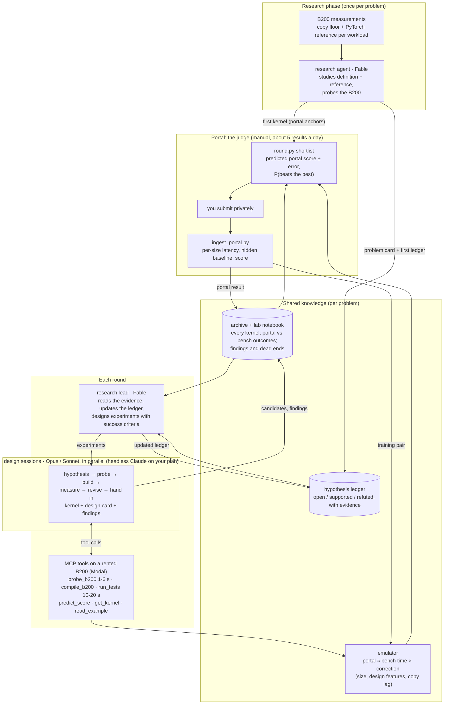

# solx: evolving B200 kernels without a B200

An automated research loop in which LLM agents design, test and refine GPU kernels for NVIDIA's
[SOL-ExecBench](https://research.nvidia.com/benchmarks/sol-execbench) leaderboard. Kernels are scored on the portal's
B200 with clocks locked. We test on a rented B200 (Modal, pay per second), correct its numbers with a multi-fidelity
emulator trained on our own portal results, and submit the best candidates to the portal by hand (about five results
a day). The first problem is #38; more are planned.

## Where we are

| Problem | Best | How | Public #1 |
|---|---|---|---|
| **#38 `038_flux_multi_head_rmsnorm_qk`** (per-head RMSNorm of Q and K, fp32, 16 sizes, 13-805 MB) | **0.6125** (`c2-cluster2-s-only`) | one-shot 256-bit kernel, outputs kept in L2, 3 tokens per thread at 1024 tokens, cluster-of-2 launch at the smallest sizes | 0.6275 |

<details><summary>#38 history</summary>

| Kernel | How it was made | Portal score |
|---|---|---|
| Scoring baseline (hidden, NVIDIA) | - | 0.500 |
| `v028` | first submission: best of 72 Triton knob variants on A100 | 0.451 |
| `v039` | best knob variant on B200 (persistent grid) | 0.531 |
| `g2-os-r8w4` | generation 2: one-shot Triton kernel | 0.577 |
| `r3-cute-ldg256-os-r16` | round r3: CuTe DSL, 256-bit loads, no cache hints | 0.588 |
| `r5-ldg256-os-r16-stel` | round r5, first interactive session: outputs kept in L2 (`evict_last` stores) | 0.609 |
| `r6-s-ldef-nc-disp` / `c1` | small-input load policy; resubmitted unchanged as a control (0.6105) | 0.610 |
| `r10-rtok-m-disp` | exploratory round r10: 3 tokens per thread at 1024 tokens | 0.611 |
| `c2-cluster2-s-only` | portal A/B after round r11: cluster-of-2 launch only at <= 300 tokens | **0.6125** |

Large inputs run at the B200's DRAM read ceiling; small inputs sit at the launch floor; medium inputs are bounded by
the write-back of dirty lines the harness's cache flush leaves in L2. Details: the problem card and the hypothesis
ledger.
</details>

## How the loop works



- **Research phase.** For a new problem, `round.py research` first measures, on the rented B200, a plain stream over
  each workload's bytes (the memory floor) and NVIDIA's PyTorch reference. A research agent then studies the
  definition, the reference code and those numbers, and writes the problem card (the problem part of every agent's
  briefing), the first hypothesis ledger, and a simple, correct first kernel. That kernel's portal result supplies
  the hidden baseline and SOL time per workload, which the score model and the emulator need.
- **Research lead.** Once per round, a Fable agent reads the lab notebook (every portal result next to its bench
  result, and every finding recorded by earlier sessions, dead ends included), the archive, the hypothesis ledger and
  the emulator's learned portal-vs-bench effects. It rewrites the ledger and designs the round's experiments: each
  tests a hypothesis, states a success criterion and what would refute it, and names a model.
- **Design sessions.** Each experiment is a headless Claude Code session on the user's Claude plan, with our tools
  served over MCP. A session tests its idea's core assumption with quick probes on the rented B200 (an NVRTC kernel in
  about a second, timed exactly as NVIDIA's harness times it), builds the kernel, and runs NVIDIA's harness on it:
  correctness at all 16 sizes and a predicted portal score with error bars. It hands in one kernel with a design card
  (hypothesis, per-path design features, findings).
- **Emulator.** The rented B200 runs its SM clock at about 1940 MHz; the portal locks it at 1500 MHz. The emulator
  learns `log(portal / rented)` per size from every kernel measured on both (a Gaussian process over design features,
  plus the kernel's lag behind a plain copy, which measures how SM-bound it is). Typical error is ±0.005-0.009 in
  score; designs unlike anything measured get wider error bars.
- **Portal.** The shortlist ranks candidates by their chance of beating the best. Slots also go to deliberate
  experiments (A/B pairs, controls) because every portal result trains the emulator and settles hypotheses.

## Running

```bash
P=L1/038                                    # any problem: L1/038, FlashInfer-Bench/021, 038_flux_multi_head_rmsnorm_qk ...
# a new problem: measurements, problem card, first ledger, first kernel (round r0)
.venv/bin/python loop/round.py research  --problem $P --backend claude --lead-model fable
# each round
.venv/bin/python loop/round.py lead      --problem $P --round r12 --backend claude --lead-model fable [--brief "..."]
.venv/bin/python loop/round.py auto      --problem $P --round r12 --use-plan --backend claude
.venv/bin/python loop/round.py shortlist --problem $P --round r12          # -> problems/<name>/rounds/r12/portal/
# after uploading: save each result page into html_results/, then
python3 poc/ingest_portal.py html_results/<page>.html
SOLX_PROBLEM=$P .venv/bin/python loop/emulator.py                            # refit + validation
```

`auto --lead` runs the lead and the sessions in one go; `--mode explore` uses a built-in idea list instead of the lead;
`--backend openrouter --interactive` runs the same sessions through OpenRouter. A round of four sessions takes about
10-15 minutes, uses a few dollars of API-equivalent usage on the Claude plan and about $1-2 of B200 time.

## Repository layout

| Path | What it is |
|---|---|
| `loop/round.py` | the loop driver: research, lead, plan, propose, auto, test, collect, shortlist, table |
| `loop/problem.py`, `loop/research.py` | problem definitions, workload sizes and bands; the research phase |
| `problems/<name>/` | one folder per problem: `card.md` (briefing), `ledger.yaml` (hypotheses), `features.yaml` (emulator), `archive.json`, `rounds/`, `b200/` (rented-B200 pairs, copy floor) |
| `loop/mcp_tools.py`, `loop/designer.py` | the session tools (MCP server for headless Claude; OpenRouter tool loop) |
| `loop/b200_modal.py`, `loop/b200probe.py` | the rented B200 on Modal (NVIDIA's software stack) and the probe helpers |
| `loop/emulator.py` | the multi-fidelity emulator (per problem) |
| `loop/pair_timings.py`, `loop/calibrate_b200.py` | timing portal-measured kernels on the rented B200 |
| `loop/planner.py` | score model, task planning, explore ideas, shortlist |
| `loop/context/` | the shared briefing: B200 architecture, public SOTA kernels, harness rules, playbook, protocol |
| `loop/archive.py` | the per-problem archive: every kernel's card, timings, compile statistics, portal results |
| `loop/toolserver.py`, `loop/jobs/` | GPU tool server and Slurm jobs for CSF3 (A100/L40S/H200; optional now) |
| `poc/` | proof of concept: 72 variants, multi-GPU timing, the first emulator rehearsal, portal ingestion |
| `poc/results/b200_portal*.csv` | every B200 portal result, per submission and per size |

## Lessons so far

- **Keeping outputs in L2 is the biggest lever found.** `evict_last` output stores gained +0.021: output still in
  the 126 MB L2 when the kernel ends is written back after the timer stops.
- **The bench is not the portal.** A rented B200 boosts its SM clock; the portal locks it at 1500 MHz. Plain
  streaming transfers 1:1, but SM-bound designs lose more on the portal, and some changes flip sign (r8/r9: -1% on the
  bench, +3-4% on the portal). The emulator learns these corrections; changes below about 1% are only settled by the
  portal.
- **The portal is precise; the bench is noisy.** Identical code resubmitted moved at most 0.3% per size (times are
  reported in 0.1 µs steps). The rented B200 varies about 1% per size between runs.
- **Most structural ideas lose to the simple one-shot kernel.** Persistent grids, work stealing, TMA bulk pipelines,
  one wave of fat CTAs, FlashInfer's lane layout and die-affine placement were each measured and refuted.
- **Launch attributes matter at the smallest sizes.** A cluster-of-2 launch cut 128-256-token workloads by 2-6% on
  the portal; clustering larger sizes hurt.
- **Fast experiments change how the agents work.** With probes in seconds, sessions test assumptions before building,
  run controls, and record negative results, and the lab notebook stops later rounds repeating dead ends.
- **Portal arithmetic** (verified): latency is the geometric mean over sizes, the score is the arithmetic mean of
  per-size scores, and your own submission pages show the hidden baseline per size.

## Setup notes

- Local: `python3 -m venv --system-site-packages .venv && .venv/bin/pip install modal mcp`. Modal login:
  `.venv/bin/python -m modal setup`. The OpenRouter key (optional) is read from `.env` (git-ignored) and never printed.
- The B200 image follows SOL-ExecBench's Dockerfile (CUDA 13.1.1, CUTLASS 4.4.1, the uv-locked environment, fbtriton
  3.7.1). Our copy of the harness skips timing windows that hold none of the user's kernels (CPU/GPU timestamp skew
  on Modal; `loop/patch_harness_timing.py`); the portal never needs this.
- CUDA C++ solutions use two files (`kernel.cu` without PyTorch headers, `binding.cpp`), which cuts a B200 build
  from about a minute to 9-18 s.
- CSF3 (optional): everything lives in `/scratch/t95317ha/solx`; account `gpu-cdt-dmcs` for H200, `gpu-sk01` for
  A100/L40S.
- The portal has no official upload API, so submission stays manual.
